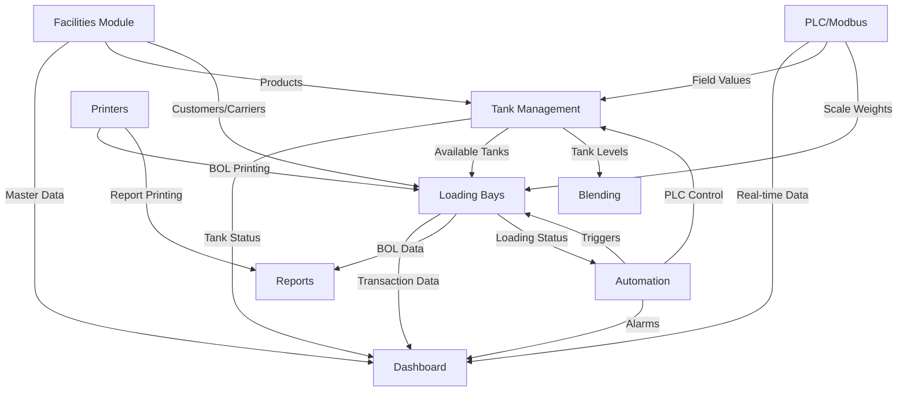

# Industrial Loading System Developer Manual
## Version 5.0 - Complete Technical Documentation with Industrial Automation Details

**KJV Solutions™**  
*Comprehensive Technical Reference Guide for Industrial Loading System*

---

## Table of Contents

1. [System Architecture](#system-architecture)
2. [Complete Project Structure with File Details](#project-structure)
3. [SQL Database Philosophy and Design](#sql-philosophy)
4. [Weight Scales and Modbus Communication](#weight-scales-modbus)
5. [Tank Blending Operations](#tank-blending)
6. [Printer Integration and BOL Management](#printer-integration)
7. [Report Generation System](#report-generation)
8. [Dashboard and Module Interactions](#dashboard-interactions)
9. [Data Flow and Dependencies](#data-flow)
10. [PLC Integration and Terminal Configuration](#plc-integration)
11. [Development Environment Setup](#development-setup)
12. [Backend Architecture](#backend-architecture)
13. [Frontend Architecture](#frontend-architecture)
14. [Automation Triggers System](#automation-triggers)
15. [API Documentation](#api-documentation)
16. [Authentication & Security](#authentication-security)
17. [Real-time Communication](#real-time-communication)
18. [Testing Strategy](#testing-strategy)
19. [Deployment Guide](#deployment-guide)
20. [Performance Optimization](#performance-optimization)
21. [Future Modules (Minimal)](#future-modules)
22. [Living Task Log](#task-log)

---

## 1. System Architecture {#system-architecture}

### Overview
The Industrial Loading System is a comprehensive petroleum terminal management platform designed for truck, rail, and marine loading operations. The system integrates real-time PLC communication, weight scale monitoring, tank blending operations, and complete BOL management with industrial printer support.

### Core Technology Stack
```yaml
Frontend:
  Framework: React 18.2.0 with TypeScript 4.9+
  Build Tool: Vite
  State Management: React Context API
  UI Components: Custom component library
  Real-time: WebSocket client
  Charting: Recharts for data visualization

Backend:
  Framework: FastAPI 0.104.1 (Python 3.9+)
  ORM: SQLAlchemy 2.0
  Database: PostgreSQL 13+
  Cache: Redis 6+
  Task Queue: Celery (optional)
  
Industrial Integration:
  PLC Communication: 
    - pycomm3 for Allen-Bradley PLCs
    - pymodbus for Modbus TCP/RTU
  Scale Communication: Serial (RS-232/RS-485)
  Printer Support: ReportLab for PDF, CUPS for network printing
  RFID: Multiple vendor support (Impinj, Alien, Zebra)
```

### System Component Architecture
```
┌──────────────────────────────────────────────────────────────┐
│                     User Interface Layer                      │
│  ┌──────────┐ ┌──────────┐ ┌──────────┐ ┌──────────┐      │
│  │Dashboard │ │ Loading  │ │   Tank   │ │ Reports  │      │
│  │  Module  │ │   Bays   │ │  Mgmt    │ │ & Export │      │
│  └──────────┘ └──────────┘ └──────────┘ └──────────┘      │
└──────────────────────────────────────────────────────────────┘
                              │
                              ▼
┌──────────────────────────────────────────────────────────────┐
│                    Application Layer (FastAPI)                │
│  ┌──────────┐ ┌──────────┐ ┌──────────┐ ┌──────────┐      │
│  │   Auth   │ │Business  │ │ Report   │ │WebSocket │      │
│  │  Service │ │  Logic   │ │Generator │ │ Manager  │      │
│  └──────────┘ └──────────┘ └──────────┘ └──────────┘      │
└──────────────────────────────────────────────────────────────┘
                              │
                              ▼
┌──────────────────────────────────────────────────────────────┐
│                    Data & Integration Layer                   │
│  ┌──────────┐ ┌──────────┐ ┌──────────┐ ┌──────────┐      │
│  │PostgreSQL│ │  Redis   │ │  Modbus  │ │  Serial  │      │
│  │ Database │ │  Cache   │ │ TCP/RTU  │ │  Comms   │      │
│  └──────────┘ └──────────┘ └──────────┘ └──────────┘      │
└──────────────────────────────────────────────────────────────┘
                              │
                              ▼
┌──────────────────────────────────────────────────────────────┐
│                    Industrial Equipment Layer                 │
│  ┌──────────┐ ┌──────────┐ ┌──────────┐ ┌──────────┐      │
│  │   PLCs   │ │  Scales  │ │ Printers │ │   RFID   │      │
│  │  (A-B)   │ │(RS-232/485)│ │(Network) │ │ Readers  │      │
│  └──────────┘ └──────────┘ └──────────┘ └──────────┘      │
└──────────────────────────────────────────────────────────────┘
```

---

## 2. Complete Project Structure with File Details {#project-structure}

### Root Directory Structure
```
industrial-loading-system/
├── backend/                        # FastAPI backend application
├── frontend/                       # React frontend application
├── database/                       # Database scripts and migrations
├── docs/                          # Documentation
├── scripts/                       # Utility and deployment scripts
├── tests/                         # Integration tests
├── docker/                        # Docker configurations
├── .env.example                   # Environment variables template
├── docker-compose.yml             # Docker orchestration
├── README.md                      # Project overview
└── LICENSE                        # License information
```

### Backend Detailed Structure
```
backend/
├── app/
│   ├── __init__.py
│   ├── main.py                    # FastAPI application entry point
│   │
│   ├── config/
│   │   ├── __init__.py
│   │   ├── settings.py            # Application settings management
│   │   ├── database.py            # Database connection configuration
│   │   └── security.py            # Security configurations
│   │
│   ├── core/
│   │   ├── __init__.py
│   │   ├── auth.py                # JWT authentication
│   │   ├── database.py            # Database session management
│   │   ├── dependencies.py        # Dependency injection
│   │   ├── events.py              # Application event handlers
│   │   ├── exceptions.py          # Custom exception classes
│   │   ├── logging_config.py      # Logging configuration
│   │   ├── middleware.py          # Custom middleware
│   │   └── utils.py               # Core utility functions
│   │
│   ├── models/                    # SQLAlchemy models
│   │   ├── __init__.py
│   │   ├── base.py                # Base model class
│   │   ├── tank.py                # Tank-related models
│   │   ├── loading.py             # Loading operation models
│   │   ├── product.py             # Product models
│   │   ├── customer.py            # Customer/carrier models
│   │   ├── bol.py                 # Bill of Lading models
│   │   ├── automation.py          # Automation trigger models
│   │   ├── scale.py               # Weight scale models
│   │   ├── blend.py               # Tank blending models
│   │   └── report.py              # Report configuration models
│   │
│   ├── modules/
│   │   ├── alarms/
│   │   │   ├── __init__.py
│   │   │   ├── models.py          # Alarm data models
│   │   │   ├── routes.py          # Alarm API endpoints
│   │   │   ├── schemas.py         # Pydantic schemas
│   │   │   ├── service.py         # Alarm business logic
│   │   │   ├── scale_routes.py    # Scale-specific alarms
│   │   │   └── plc_status_updater.py # PLC alarm monitoring
│   │   │
│   │   ├── audit/
│   │   │   ├── __init__.py
│   │   │   ├── models.py          # Audit trail models
│   │   │   ├── routes.py          # Audit API endpoints
│   │   │   ├── schemas.py         # Audit schemas
│   │   │   └── service.py         # Audit logging service
│   │   │
│   │   ├── auth/
│   │   │   ├── __init__.py
│   │   │   ├── dependencies.py    # Auth dependencies
│   │   │   ├── routes.py          # Authentication endpoints
│   │   │   ├── schemas.py         # Auth schemas
│   │   │   ├── service.py         # Auth business logic
│   │   │   └── token_store.py     # Token management
│   │   │
│   │   ├── automation/
│   │   │   ├── __init__.py
│   │   │   ├── allen_bradley_service.py # Allen-Bradley PLC service
│   │   │   ├── models.py          # Automation models
│   │   │   ├── rfid_service.py    # RFID reader service
│   │   │   ├── routes.py          # Automation endpoints
│   │   │   ├── schemas.py         # Automation schemas
│   │   │   ├── trigger_service.py # Trigger execution engine
│   │   │   └── trucks_routes.py   # Truck automation routes
│   │   │
│   │   ├── hardware/
│   │   │   ├── __init__.py
│   │   │   ├── weight_scale.py    # Weight scale communication
│   │   │   ├── printer_service.py # Printer integration
│   │   │   └── rfid_reader.py     # RFID hardware interface
│   │   │
│   │   ├── plc_communication/
│   │   │   ├── __init__.py
│   │   │   ├── modbus_tcp.py      # Modbus TCP client
│   │   │   ├── modbus_rtu.py      # Modbus RTU client
│   │   │   ├── allen_bradley.py   # Allen-Bradley specific
│   │   │   └── plc_manager.py     # PLC connection manager
│   │   │
│   │   ├── loading_bays/
│   │   │   ├── __init__.py
│   │   │   ├── models.py          # Loading bay models
│   │   │   ├── routes.py          # Loading bay endpoints
│   │   │   ├── schemas.py         # Loading schemas
│   │   │   ├── service.py         # Loading business logic
│   │   │   ├── bol_routes.py      # BOL management routes
│   │   │   ├── bol_service.py     # BOL generation service
│   │   │   ├── blend_service.py   # Tank blending service
│   │   │   └── printer_routes.py  # Printer control routes
│   │   │
│   │   ├── tanks/
│   │   │   ├── __init__.py
│   │   │   ├── models.py          # Tank models
│   │   │   ├── routes.py          # Tank management routes
│   │   │   ├── schemas.py         # Tank schemas
│   │   │   ├── service.py         # Tank business logic
│   │   │   ├── gauging_routes.py  # Tank gauging endpoints
│   │   │   ├── reconciliation_routes.py # Reconciliation
│   │   │   └── blend_routes.py    # Blending operations
│   │   │
│   │   ├── reporting/
│   │   │   ├── __init__.py
│   │   │   ├── pdf_generator.py   # PDF report generation
│   │   │   ├── excel_generator.py # Excel export
│   │   │   ├── report_templates.py # Report templates
│   │   │   ├── scheduled_reports.py # Automated reporting
│   │   │   └── report_service.py  # Report business logic
│   │   │
│   │   ├── facilities/
│   │   │   ├── __init__.py
│   │   │   ├── models.py          # Facility models
│   │   │   ├── routes.py          # Facility endpoints
│   │   │   ├── schemas.py         # Facility schemas
│   │   │   ├── service.py         # Facility logic
│   │   │   ├── customer_routes.py # Customer management
│   │   │   ├── carrier_routes.py  # Carrier management
│   │   │   └── terminal_routes.py # Terminal configuration
│   │   │
│   │   ├── dashboard/
│   │   │   ├── __init__.py
│   │   │   ├── router.py          # Dashboard API routes
│   │   │   ├── aggregator.py      # Data aggregation service
│   │   │   └── realtime_service.py # Real-time updates
│   │   │
│   │   └── websocket/
│   │       ├── __init__.py
│   │       ├── connection_manager.py # WebSocket connections
│   │       ├── routes.py          # WebSocket endpoints
│   │       └── events.py          # Event broadcasting
│   │
│   ├── schemas/                   # Pydantic schemas
│   │   └── [corresponding schema files]
│   │
│   └── services/                  # Business services
│       ├── calculation.py         # Volume/weight calculations
│       ├── notification.py        # Alert notifications
│       └── validation.py          # Data validation
│
├── alembic/                       # Database migrations
│   ├── versions/                  # Migration files
│   └── alembic.ini               # Alembic configuration
│
├── tests/                         # Test suite
│   ├── unit/                     # Unit tests
│   ├── integration/              # Integration tests
│   └── conftest.py              # Test configuration
│
├── requirements.txt              # Python dependencies
└── .env                         # Environment variables
```

### Frontend Detailed Structure
```
frontend/
├── public/
│   ├── index.html               # Main HTML file
│   ├── favicon.ico             # Application icon
│   └── assets/                 # Static assets
│
├── src/
│   ├── components/              # Reusable components
│   │   ├── common/
│   │   │   ├── Header.tsx      # Application header
│   │   │   ├── Navigation.tsx  # Navigation menu
│   │   │   ├── Footer.tsx      # Application footer
│   │   │   └── LoadingSpinner.tsx
│   │   │
│   │   ├── ui/                 # UI component library
│   │   │   ├── Button.tsx
│   │   │   ├── Card.tsx
│   │   │   ├── Modal.tsx
│   │   │   ├── Table.tsx
│   │   │   ├── Form.tsx
│   │   │   └── Charts.tsx
│   │   │
│   │   └── layout/             # Layout components
│   │       ├── MainLayout.tsx
│   │       └── DashboardLayout.tsx
│   │
│   ├── modules/
│   │   ├── dashboard/
│   │   │   ├── Dashboard.tsx   # Main dashboard view
│   │   │   ├── DashboardWidgets.tsx
│   │   │   ├── SystemStatus.tsx
│   │   │   └── QuickActions.tsx
│   │   │
│   │   ├── tanks/
│   │   │   ├── TankOverview.tsx
│   │   │   ├── TankDetails.tsx
│   │   │   ├── TankGauging.tsx
│   │   │   ├── TankReconciliation.tsx
│   │   │   └── components/
│   │   │       ├── TankCard.tsx
│   │   │       ├── LevelIndicator.tsx
│   │   │       └── GaugeHistory.tsx
│   │   │
│   │   ├── loading-bays/
│   │   │   ├── LoadingBays.tsx
│   │   │   ├── BOLManagement.tsx
│   │   │   ├── BlendingTerminal.tsx # Tank blending UI
│   │   │   ├── components/
│   │   │   │   ├── BOLDetailsModal.tsx
│   │   │   │   ├── WeightThresholdTrigger.tsx
│   │   │   │   ├── PrinterControl.tsx
│   │   │   │   └── BlendRecipe.tsx
│   │   │   └── services/
│   │   │       ├── bolService.ts
│   │   │       └── blendCalculations.ts
│   │   │
│   │   ├── facilities/
│   │   │   ├── FacilitiesManagement.tsx
│   │   │   ├── CustomerManagement.tsx
│   │   │   ├── CarrierManagement.tsx
│   │   │   ├── ProductConfiguration.tsx
│   │   │   └── TerminalSettings.tsx
│   │   │
│   │   ├── automation/
│   │   │   ├── AutomationDashboard.tsx
│   │   │   ├── TriggerConfiguration.tsx
│   │   │   ├── PLCMonitoring.tsx
│   │   │   ├── ScaleMonitoring.tsx
│   │   │   └── ModbusConfiguration.tsx
│   │   │
│   │   ├── reports/
│   │   │   ├── Reports.tsx
│   │   │   ├── ReportBuilder.tsx
│   │   │   ├── ReportScheduler.tsx
│   │   │   ├── ExportManager.tsx
│   │   │   └── services/
│   │   │       └── reportingApi.ts
│   │   │
│   │   └── system/
│   │       ├── SystemConfiguration.tsx
│   │       ├── UserManagement.tsx
│   │       └── AuditLog.tsx
│   │
│   ├── services/                # API and utility services
│   │   ├── api.ts              # API client
│   │   ├── auth.ts             # Authentication service
│   │   ├── websocket.ts        # WebSocket client
│   │   └── calculations.ts     # Client-side calculations
│   │
│   ├── hooks/                   # Custom React hooks
│   │   ├── useAuth.ts
│   │   ├── useWebSocket.ts
│   │   ├── useApi.ts
│   │   └── useRealTimeData.ts
│   │
│   ├── types/                   # TypeScript definitions
│   │   ├── api.types.ts
│   │   ├── models.types.ts
│   │   └── components.types.ts
│   │
│   ├── utils/                   # Utility functions
│   │   ├── formatters.ts
│   │   ├── validators.ts
│   │   └── constants.ts
│   │
│   ├── App.tsx                  # Main application component
│   ├── index.tsx                # Application entry point
│   └── vite-env.d.ts           # Vite type definitions
│
├── package.json                 # Node dependencies
├── tsconfig.json               # TypeScript configuration
├── vite.config.ts              # Vite build configuration
└── .env                        # Environment variables
```

---

## 3. SQL Database Philosophy and Design {#sql-philosophy}

### Database Design Philosophy

#### Core Principles
1. **Normalization**: Tables are normalized to 3NF to eliminate redundancy
2. **Referential Integrity**: Foreign keys enforce data consistency
3. **Audit Trail**: All critical operations are logged with timestamps and user information
4. **Soft Deletes**: Records are marked inactive rather than deleted
5. **UUID Primary Keys**: Globally unique identifiers for distributed systems
6. **Optimistic Locking**: Version columns prevent concurrent update conflicts

### Complete Database Schema

#### Core Tables Structure

```sql
-- Products Table (Master Data)
CREATE TABLE products (
    id SERIAL PRIMARY KEY,
    product_code VARCHAR(50) UNIQUE NOT NULL,
    product_name VARCHAR(100) NOT NULL,
    product_type VARCHAR(50), -- 'CRUDE', 'GASOLINE', 'DIESEL', 'JET_FUEL'
    api_gravity DECIMAL(5,2),
    specific_gravity DECIMAL(6,4),
    viscosity DECIMAL(8,2),
    color VARCHAR(50),
    is_active BOOLEAN DEFAULT true,
    created_at TIMESTAMP DEFAULT CURRENT_TIMESTAMP,
    updated_at TIMESTAMP,
    created_by VARCHAR(100),
    version INTEGER DEFAULT 1
);

-- Customers Table (Master Data)
CREATE TABLE customers (
    id VARCHAR(36) PRIMARY KEY DEFAULT gen_random_uuid(),
    customer_code VARCHAR(50) UNIQUE NOT NULL,
    customer_name VARCHAR(200) NOT NULL,
    customer_type VARCHAR(50), -- 'WHOLESALE', 'RETAIL', 'INTERNAL'
    address TEXT,
    city VARCHAR(100),
    state VARCHAR(50),
    zip_code VARCHAR(20),
    country VARCHAR(100),
    tax_id VARCHAR(50),
    credit_limit DECIMAL(15,2),
    payment_terms INTEGER, -- Days
    contact_name VARCHAR(100),
    contact_phone VARCHAR(50),
    contact_email VARCHAR(100),
    is_active BOOLEAN DEFAULT true,
    created_at TIMESTAMP DEFAULT CURRENT_TIMESTAMP,
    updated_at TIMESTAMP
);

-- Carriers Table (Master Data)
CREATE TABLE carriers (
    id VARCHAR(36) PRIMARY KEY DEFAULT gen_random_uuid(),
    carrier_code VARCHAR(50) UNIQUE NOT NULL,
    carrier_name VARCHAR(200) NOT NULL,
    carrier_type VARCHAR(50), -- 'TRUCK', 'RAIL', 'BARGE'
    dot_number VARCHAR(50),
    mc_number VARCHAR(50),
    insurance_policy VARCHAR(100),
    insurance_expiry DATE,
    is_active BOOLEAN DEFAULT true,
    created_at TIMESTAMP DEFAULT CURRENT_TIMESTAMP,
    updated_at TIMESTAMP
);

-- Tanks Table (Core Operational)
CREATE TABLE tanks (
    id VARCHAR(36) PRIMARY KEY DEFAULT gen_random_uuid(),
    tank_number VARCHAR(50) UNIQUE NOT NULL,
    tank_type VARCHAR(50), -- 'STORAGE', 'BLEND', 'SURGE'
    capacity DECIMAL(12,2) NOT NULL,
    current_volume DECIMAL(12,2) DEFAULT 0,
    current_level DECIMAL(5,2), -- Percentage
    product_id INTEGER REFERENCES products(id),
    temperature DECIMAL(6,2),
    pressure DECIMAL(8,2),
    api_gravity DECIMAL(5,2),
    
    -- Physical specifications
    diameter DECIMAL(8,2),
    height DECIMAL(8,2),
    shell_capacity DECIMAL(12,2),
    working_capacity DECIMAL(12,2),
    minimum_volume DECIMAL(12,2),
    
    -- PLC Configuration
    plc_tag_prefix VARCHAR(100),
    level_tag VARCHAR(100),
    temperature_tag VARCHAR(100),
    pressure_tag VARCHAR(100),
    
    -- Status tracking
    status VARCHAR(50) DEFAULT 'ACTIVE', -- 'ACTIVE', 'MAINTENANCE', 'OUT_OF_SERVICE'
    last_gauge_time TIMESTAMP,
    last_movement_time TIMESTAMP,
    
    created_at TIMESTAMP DEFAULT CURRENT_TIMESTAMP,
    updated_at TIMESTAMP,
    CONSTRAINT chk_volume CHECK (current_volume >= 0 AND current_volume <= capacity)
);

-- Tank Strapping Tables (Calibration Data)
CREATE TABLE strapping_tables (
    id VARCHAR(36) PRIMARY KEY DEFAULT gen_random_uuid(),
    tank_id VARCHAR(36) REFERENCES tanks(id),
    level_inches DECIMAL(8,2) NOT NULL,
    volume_gallons DECIMAL(12,2) NOT NULL,
    created_at TIMESTAMP DEFAULT CURRENT_TIMESTAMP,
    UNIQUE(tank_id, level_inches)
);

-- Loading Bays Table
CREATE TABLE loading_bays (
    id VARCHAR(36) PRIMARY KEY DEFAULT gen_random_uuid(),
    bay_number VARCHAR(50) UNIQUE NOT NULL,
    bay_type VARCHAR(50), -- 'TRUCK', 'RAIL', 'MARINE'
    status VARCHAR(50) DEFAULT 'AVAILABLE', -- 'AVAILABLE', 'LOADING', 'MAINTENANCE'
    
    -- Equipment configuration
    has_scale BOOLEAN DEFAULT true,
    scale_id VARCHAR(100),
    has_meter BOOLEAN DEFAULT true,
    meter_id VARCHAR(100),
    has_printer BOOLEAN DEFAULT true,
    printer_id VARCHAR(100),
    
    -- PLC configuration
    plc_prefix VARCHAR(100),
    flow_rate_tag VARCHAR(100),
    total_flow_tag VARCHAR(100),
    valve_control_tag VARCHAR(100),
    emergency_stop_tag VARCHAR(100),
    
    -- Capacity specifications
    max_flow_rate DECIMAL(10,2),
    preset_limit DECIMAL(12,2),
    
    created_at TIMESTAMP DEFAULT CURRENT_TIMESTAMP,
    updated_at TIMESTAMP
);

-- Loading Bay Tank Assignments (Many-to-Many)
CREATE TABLE loading_bay_tank_assignments (
    id VARCHAR(36) PRIMARY KEY DEFAULT gen_random_uuid(),
    loading_bay_id VARCHAR(36) REFERENCES loading_bays(id),
    tank_id VARCHAR(36) REFERENCES tanks(id),
    priority INTEGER DEFAULT 1,
    is_active BOOLEAN DEFAULT true,
    created_at TIMESTAMP DEFAULT CURRENT_TIMESTAMP,
    UNIQUE(loading_bay_id, tank_id)
);

-- Drivers Table
CREATE TABLE drivers (
    id VARCHAR(36) PRIMARY KEY DEFAULT gen_random_uuid(),
    driver_license VARCHAR(50) UNIQUE NOT NULL,
    driver_name VARCHAR(200) NOT NULL,
    carrier_id VARCHAR(36) REFERENCES carriers(id),
    twic_number VARCHAR(50),
    twic_expiry DATE,
    hazmat_endorsement BOOLEAN DEFAULT false,
    hazmat_expiry DATE,
    is_active BOOLEAN DEFAULT true,
    created_at TIMESTAMP DEFAULT CURRENT_TIMESTAMP,
    updated_at TIMESTAMP
);

-- Trucks Table
CREATE TABLE trucks (
    id VARCHAR(36) PRIMARY KEY DEFAULT gen_random_uuid(),
    truck_number VARCHAR(50) UNIQUE NOT NULL,
    carrier_id VARCHAR(36) REFERENCES carriers(id),
    compartments INTEGER DEFAULT 1,
    total_capacity DECIMAL(12,2),
    tare_weight DECIMAL(10,2),
    max_gross_weight DECIMAL(10,2),
    last_inspection DATE,
    is_active BOOLEAN DEFAULT true,
    created_at TIMESTAMP DEFAULT CURRENT_TIMESTAMP,
    updated_at TIMESTAMP
);

-- Loading Transactions Table (Core Transaction)
CREATE TABLE loading_transactions (
    id VARCHAR(36) PRIMARY KEY DEFAULT gen_random_uuid(),
    transaction_number VARCHAR(50) UNIQUE NOT NULL,
    transaction_type VARCHAR(50), -- 'LOADING', 'UNLOADING'
    
    -- Relationships
    loading_bay_id VARCHAR(36) REFERENCES loading_bays(id),
    tank_id VARCHAR(36) REFERENCES tanks(id),
    truck_id VARCHAR(36) REFERENCES trucks(id),
    driver_id VARCHAR(36) REFERENCES drivers(id),
    customer_id VARCHAR(36) REFERENCES customers(id),
    carrier_id VARCHAR(36) REFERENCES carriers(id),
    product_id INTEGER REFERENCES products(id),
    
    -- Quantities
    preset_volume DECIMAL(12,2),
    actual_volume DECIMAL(12,2),
    gross_volume DECIMAL(12,2),
    net_volume DECIMAL(12,2),
    temperature DECIMAL(6,2),
    api_gravity DECIMAL(5,2),
    
    -- Weights
    tare_weight DECIMAL(10,2),
    gross_weight DECIMAL(10,2),
    net_weight DECIMAL(10,2),
    
    -- Timing
    start_time TIMESTAMP,
    end_time TIMESTAMP,
    loading_time_minutes INTEGER,
    
    -- Status
    status VARCHAR(50), -- 'PENDING', 'LOADING', 'COMPLETED', 'CANCELLED'
    
    -- BOL Reference
    bol_id VARCHAR(36),
    
    created_at TIMESTAMP DEFAULT CURRENT_TIMESTAMP,
    updated_at TIMESTAMP,
    created_by VARCHAR(100)
);

-- Bills of Lading Table
CREATE TABLE bills_of_lading (
    id VARCHAR(36) PRIMARY KEY DEFAULT gen_random_uuid(),
    bol_number VARCHAR(50) UNIQUE NOT NULL,
    bol_date DATE NOT NULL,
    
    -- Transaction reference
    transaction_id VARCHAR(36) REFERENCES loading_transactions(id),
    
    -- Parties
    customer_id VARCHAR(36) REFERENCES customers(id),
    carrier_id VARCHAR(36) REFERENCES carriers(id),
    driver_id VARCHAR(36) REFERENCES drivers(id),
    
    -- Product details
    product_id INTEGER REFERENCES products(id),
    
    -- Quantities
    quantity DECIMAL(12,2),
    unit_of_measure VARCHAR(20), -- 'GALLONS', 'BARRELS', 'LITERS'
    temperature DECIMAL(6,2),
    api_gravity DECIMAL(5,2),
    observed_volume DECIMAL(12,2),
    gross_volume DECIMAL(12,2),
    net_volume DECIMAL(12,2),
    
    -- Additional information
    seal_numbers TEXT,
    special_instructions TEXT,
    
    -- Signatures
    driver_signature TEXT, -- Base64 encoded signature
    operator_signature TEXT,
    signed_at TIMESTAMP,
    
    -- Print/Email tracking
    printed_count INTEGER DEFAULT 0,
    last_printed_at TIMESTAMP,
    emailed_to TEXT,
    emailed_at TIMESTAMP,
    
    -- Status
    status VARCHAR(50) DEFAULT 'DRAFT', -- 'DRAFT', 'SIGNED', 'VOID'
    
    created_at TIMESTAMP DEFAULT CURRENT_TIMESTAMP,
    updated_at TIMESTAMP,
    created_by VARCHAR(100)
);

-- Tank Blending Operations Table
CREATE TABLE tank_blends (
    id VARCHAR(36) PRIMARY KEY DEFAULT gen_random_uuid(),
    blend_number VARCHAR(50) UNIQUE NOT NULL,
    blend_name VARCHAR(200),
    target_tank_id VARCHAR(36) REFERENCES tanks(id),
    
    -- Blend recipe
    total_volume DECIMAL(12,2),
    blend_recipe JSONB, -- Stores component percentages
    
    -- Status
    status VARCHAR(50), -- 'PLANNING', 'IN_PROGRESS', 'COMPLETED'
    
    -- Timing
    start_time TIMESTAMP,
    end_time TIMESTAMP,
    
    -- Quality parameters
    target_api_gravity DECIMAL(5,2),
    actual_api_gravity DECIMAL(5,2),
    target_viscosity DECIMAL(8,2),
    actual_viscosity DECIMAL(8,2),
    
    created_at TIMESTAMP DEFAULT CURRENT_TIMESTAMP,
    updated_at TIMESTAMP,
    created_by VARCHAR(100)
);

-- Blend Components Table
CREATE TABLE blend_components (
    id VARCHAR(36) PRIMARY KEY DEFAULT gen_random_uuid(),
    blend_id VARCHAR(36) REFERENCES tank_blends(id),
    source_tank_id VARCHAR(36) REFERENCES tanks(id),
    product_id INTEGER REFERENCES products(id),
    
    -- Quantities
    planned_volume DECIMAL(12,2),
    actual_volume DECIMAL(12,2),
    percentage DECIMAL(5,2),
    
    -- Flow control
    flow_rate DECIMAL(10,2),
    start_time TIMESTAMP,
    end_time TIMESTAMP,
    
    created_at TIMESTAMP DEFAULT CURRENT_TIMESTAMP
);

-- Weight Scale Readings Table
CREATE TABLE scale_readings (
    id VARCHAR(36) PRIMARY KEY DEFAULT gen_random_uuid(),
    scale_id VARCHAR(100),
    transaction_id VARCHAR(36) REFERENCES loading_transactions(id),
    
    reading_type VARCHAR(50), -- 'TARE', 'GROSS', 'NET'
    weight_value DECIMAL(10,2),
    unit VARCHAR(20), -- 'LBS', 'KG'
    
    stability_indicator BOOLEAN DEFAULT true,
    reading_time TIMESTAMP DEFAULT CURRENT_TIMESTAMP,
    
    created_by VARCHAR(100)
);

-- Modbus Device Registry
CREATE TABLE modbus_devices (
    id VARCHAR(36) PRIMARY KEY DEFAULT gen_random_uuid(),
    device_name VARCHAR(100) NOT NULL,
    device_type VARCHAR(50), -- 'PLC', 'VFD', 'METER', 'SENSOR'
    protocol VARCHAR(20), -- 'TCP', 'RTU'
    
    -- Connection details
    ip_address VARCHAR(50),
    port INTEGER DEFAULT 502,
    slave_id INTEGER,
    
    -- RTU specific
    serial_port VARCHAR(50),
    baud_rate INTEGER,
    parity VARCHAR(10),
    stop_bits INTEGER,
    data_bits INTEGER,
    
    -- Status
    is_active BOOLEAN DEFAULT true,
    last_poll_time TIMESTAMP,
    last_poll_status VARCHAR(50),
    
    created_at TIMESTAMP DEFAULT CURRENT_TIMESTAMP,
    updated_at TIMESTAMP
);

-- Modbus Register Mapping
CREATE TABLE modbus_registers (
    id VARCHAR(36) PRIMARY KEY DEFAULT gen_random_uuid(),
    device_id VARCHAR(36) REFERENCES modbus_devices(id),
    register_name VARCHAR(100),
    register_address INTEGER NOT NULL,
    register_type VARCHAR(50), -- 'HOLDING', 'INPUT', 'COIL', 'DISCRETE'
    data_type VARCHAR(50), -- 'INT16', 'UINT16', 'INT32', 'FLOAT32', 'BOOLEAN'
    scale_factor DECIMAL(10,6) DEFAULT 1.0,
    unit VARCHAR(50),
    description TEXT,
    
    -- Polling configuration
    poll_enabled BOOLEAN DEFAULT true,
    poll_interval_ms INTEGER DEFAULT 1000,
    
    created_at TIMESTAMP DEFAULT CURRENT_TIMESTAMP,
    UNIQUE(device_id, register_address)
);

-- Printer Configuration Table
CREATE TABLE printers (
    id VARCHAR(36) PRIMARY KEY DEFAULT gen_random_uuid(),
    printer_name VARCHAR(100) NOT NULL,
    printer_type VARCHAR(50), -- 'NETWORK', 'USB', 'THERMAL', 'LABEL'
    
    -- Network printer details
    ip_address VARCHAR(50),
    port INTEGER,
    printer_path VARCHAR(200), -- Network path or CUPS name
    
    -- Configuration
    default_paper_size VARCHAR(20), -- 'LETTER', 'A4', 'THERMAL_80MM'
    default_orientation VARCHAR(20), -- 'PORTRAIT', 'LANDSCAPE'
    
    -- Assignment
    location VARCHAR(100),
    assigned_to VARCHAR(50), -- 'BAY_01', 'OFFICE', etc.
    
    is_default BOOLEAN DEFAULT false,
    is_active BOOLEAN DEFAULT true,
    
    created_at TIMESTAMP DEFAULT CURRENT_TIMESTAMP,
    updated_at TIMESTAMP
);

-- Report Templates Table
CREATE TABLE report_templates (
    id VARCHAR(36) PRIMARY KEY DEFAULT gen_random_uuid(),
    template_name VARCHAR(100) NOT NULL,
    template_type VARCHAR(50), -- 'BOL', 'INVENTORY', 'RECONCILIATION', 'AUDIT'
    
    -- Template configuration
    template_file VARCHAR(200), -- Path to template file
    output_format VARCHAR(20), -- 'PDF', 'EXCEL', 'CSV'
    
    -- Parameters
    parameters JSONB, -- Dynamic parameters for the template
    
    -- Scheduling
    is_scheduled BOOLEAN DEFAULT false,
    schedule_cron VARCHAR(100), -- Cron expression for scheduling
    
    created_at TIMESTAMP DEFAULT CURRENT_TIMESTAMP,
    updated_at TIMESTAMP,
    created_by VARCHAR(100)
);

-- Report Executions Table
CREATE TABLE report_executions (
    id VARCHAR(36) PRIMARY KEY DEFAULT gen_random_uuid(),
    template_id VARCHAR(36) REFERENCES report_templates(id),
    
    -- Execution details
    execution_time TIMESTAMP DEFAULT CURRENT_TIMESTAMP,
    parameters JSONB,
    
    -- Output
    output_file_path TEXT,
    output_format VARCHAR(20),
    file_size_bytes BIGINT,
    
    -- Status
    status VARCHAR(50), -- 'PENDING', 'RUNNING', 'COMPLETED', 'FAILED'
    error_message TEXT,
    
    -- Distribution
    emailed_to TEXT,
    printed BOOLEAN DEFAULT false,
    
    created_by VARCHAR(100)
);

-- Automation Triggers Table (Enhanced)
CREATE TABLE automation_triggers (
    id VARCHAR(36) PRIMARY KEY DEFAULT gen_random_uuid(),
    trigger_name VARCHAR(100) NOT NULL,
    trigger_type VARCHAR(50), -- 'PLC_VALUE', 'WEIGHT', 'TIME', 'EVENT'
    
    -- Configuration
    is_active BOOLEAN DEFAULT true,
    priority INTEGER DEFAULT 5,
    
    -- Trigger conditions
    conditions JSONB NOT NULL,
    
    -- Actions to perform
    actions JSONB NOT NULL,
    
    -- PLC specific
    plc_tag_id VARCHAR(100),
    plc_tag_value_type VARCHAR(50),
    
    -- Weight specific
    scale_id VARCHAR(100),
    weight_threshold DECIMAL(10,2),
    
    -- Associations
    loading_bay_id VARCHAR(36) REFERENCES loading_bays(id),
    tank_id VARCHAR(36) REFERENCES tanks(id),
    
    -- Execution tracking
    last_triggered_at TIMESTAMP,
    trigger_count INTEGER DEFAULT 0,
    
    created_at TIMESTAMP DEFAULT CURRENT_TIMESTAMP,
    updated_at TIMESTAMP,
    created_by VARCHAR(100)
);

-- System Configuration Table
CREATE TABLE system_configuration (
    id VARCHAR(36) PRIMARY KEY DEFAULT gen_random_uuid(),
    config_key VARCHAR(100) UNIQUE NOT NULL,
    config_value TEXT,
    config_type VARCHAR(50), -- 'STRING', 'NUMBER', 'BOOLEAN', 'JSON'
    description TEXT,
    is_encrypted BOOLEAN DEFAULT false,
    
    created_at TIMESTAMP DEFAULT CURRENT_TIMESTAMP,
    updated_at TIMESTAMP,
    updated_by VARCHAR(100)
);

-- Audit Trail Table
CREATE TABLE audit_trail (
    id VARCHAR(36) PRIMARY KEY DEFAULT gen_random_uuid(),
    table_name VARCHAR(100) NOT NULL,
    record_id VARCHAR(36) NOT NULL,
    action VARCHAR(50) NOT NULL, -- 'INSERT', 'UPDATE', 'DELETE'
    
    -- Change details
    old_values JSONB,
    new_values JSONB,
    changed_fields TEXT[],
    
    -- User information
    user_id VARCHAR(100),
    user_name VARCHAR(200),
    user_role VARCHAR(50),
    
    -- Context
    ip_address VARCHAR(50),
    user_agent TEXT,
    
    created_at TIMESTAMP DEFAULT CURRENT_TIMESTAMP
);

-- Create indexes for performance
CREATE INDEX idx_tanks_product ON tanks(product_id);
CREATE INDEX idx_tanks_status ON tanks(status);
CREATE INDEX idx_loading_transactions_status ON loading_transactions(status);
CREATE INDEX idx_loading_transactions_date ON loading_transactions(start_time);
CREATE INDEX idx_loading_transactions_customer ON loading_transactions(customer_id);
CREATE INDEX idx_bol_transaction ON bills_of_lading(transaction_id);
CREATE INDEX idx_bol_date ON bills_of_lading(bol_date);
CREATE INDEX idx_audit_table_record ON audit_trail(table_name, record_id);
CREATE INDEX idx_audit_created ON audit_trail(created_at);
CREATE INDEX idx_scale_readings_transaction ON scale_readings(transaction_id);
CREATE INDEX idx_blend_components_blend ON blend_components(blend_id);
```

### Data Flow Philosophy

The database design follows a clear data flow pattern:

1. **Master Data Entry** → Facilities Module
   - Products, Customers, Carriers, Drivers, Trucks
   - This data feeds all operational modules

2. **Configuration Data** → System Setup
   - Tanks, Loading Bays, Printers, Modbus Devices
   - Terminal-specific configuration

3. **Operational Data** → Daily Operations
   - Loading Transactions, BOLs, Scale Readings
   - Real-time data from field devices

4. **Analytical Data** → Reporting
   - Aggregated data for reports
   - Historical trends and analytics

---

## 4. Weight Scales and Modbus Communication {#weight-scales-modbus}

### Weight Scale Integration

#### Serial Communication Implementation
```python
# backend/app/modules/hardware/weight_scale.py
import serial
import asyncio
from typing import Optional, Callable
from dataclasses import dataclass

@dataclass
class ScaleReading:
    weight: float
    unit: str  # 'LBS', 'KG'
    stable: bool
    timestamp: datetime

class WeightScale:
    """Industrial weight scale communication handler"""
    
    def __init__(self, port: str, baudrate: int = 9600):
        self.port = port
        self.baudrate = baudrate
        self.serial_conn: Optional[serial.Serial] = None
        self.reading_callback: Optional[Callable] = None
        
    async def connect(self) -> bool:
        """Establish serial connection to scale"""
        try:
            self.serial_conn = serial.Serial(
                port=self.port,
                baudrate=self.baudrate,
                bytesize=serial.EIGHTBITS,
                parity=serial.PARITY_NONE,
                stopbits=serial.STOPBITS_ONE,
                timeout=1.0
            )
            return True
        except serial.SerialException as e:
            logger.error(f"Scale connection failed: {e}")
            return False
    
    async def read_weight(self) -> ScaleReading:
        """Read current weight from scale"""
        if not self.serial_conn:
            raise Exception("Scale not connected")
        
        # Send read command (varies by manufacturer)
        self.serial_conn.write(b'R\r\n')  # Common read command
        
        # Read response
        response = self.serial_conn.readline()
        
        # Parse response (format varies by scale model)
        return self._parse_response(response)
    
    def _parse_response(self, data: bytes) -> ScaleReading:
        """Parse scale response data"""
        # Example format: "ST,GS,+00001234.5,lb\r\n"
        # ST = Stable, GS = Gross, weight, unit
        
        parts = data.decode('ascii').strip().split(',')
        
        stable = parts[0] == 'ST'
        weight = float(parts[2])
        unit = parts[3].upper()
        
        return ScaleReading(
            weight=weight,
            unit=unit,
            stable=stable,
            timestamp=datetime.utcnow()
        )
    
    async def continuous_reading(self, callback: Callable):
        """Start continuous weight monitoring"""
        self.reading_callback = callback
        
        while self.serial_conn and self.serial_conn.is_open:
            try:
                reading = await self.read_weight()
                if self.reading_callback:
                    await self.reading_callback(reading)
                await asyncio.sleep(0.5)  # Read every 500ms
            except Exception as e:
                logger.error(f"Scale reading error: {e}")
                await asyncio.sleep(1)
    
    async def zero_scale(self) -> bool:
        """Zero/tare the scale"""
        if not self.serial_conn:
            return False
        
        self.serial_conn.write(b'Z\r\n')  # Zero command
        response = self.serial_conn.readline()
        return b'OK' in response
    
    async def print_ticket(self, transaction_data: dict) -> bool:
        """Trigger scale ticket printer"""
        if not self.serial_conn:
            return False
        
        # Format print command with transaction data
        print_cmd = self._format_print_command(transaction_data)
        self.serial_conn.write(print_cmd.encode())
        
        response = self.serial_conn.readline()
        return b'PRINTED' in response
```

#### Scale Configuration and Management
```python
# backend/app/modules/hardware/scale_manager.py
from typing import Dict, List
import asyncio

class ScaleManager:
    """Manages multiple scale connections"""
    
    def __init__(self):
        self.scales: Dict[str, WeightScale] = {}
        self.monitoring_tasks: Dict[str, asyncio.Task] = {}
        
    async def initialize_scales(self, config: List[dict]):
        """Initialize all configured scales"""
        for scale_config in config:
            scale = WeightScale(
                port=scale_config['port'],
                baudrate=scale_config.get('baudrate', 9600)
            )
            
            if await scale.connect():
                self.scales[scale_config['id']] = scale
                
                # Start monitoring if configured
                if scale_config.get('continuous_monitoring'):
                    task = asyncio.create_task(
                        scale.continuous_reading(
                            self._create_callback(scale_config['id'])
                        )
                    )
                    self.monitoring_tasks[scale_config['id']] = task
    
    def _create_callback(self, scale_id: str):
        """Create callback for scale readings"""
        async def callback(reading: ScaleReading):
            # Broadcast reading via WebSocket
            await broadcast_scale_reading(scale_id, reading)
            
            # Check for weight thresholds
            await self.check_weight_triggers(scale_id, reading)
            
            # Store reading in database
            await self.store_reading(scale_id, reading)
        
        return callback
    
    async def check_weight_triggers(self, scale_id: str, reading: ScaleReading):
        """Check automation triggers based on weight"""
        triggers = await get_weight_triggers(scale_id)
        
        for trigger in triggers:
            if self.evaluate_trigger(trigger, reading):
                await execute_trigger_actions(trigger)
```

### Modbus Communication

#### Modbus TCP Implementation
```python
# backend/app/modules/plc_communication/modbus_tcp.py
from pymodbus.client import AsyncModbusTcpClient
from pymodbus.payload import BinaryPayloadDecoder
from pymodbus.constants import Endian
import struct

class ModbusTCPClient:
    """Modbus TCP client for industrial device communication"""
    
    def __init__(self, host: str, port: int = 502):
        self.host = host
        self.port = port
        self.client: Optional[AsyncModbusTcpClient] = None
        
    async def connect(self) -> bool:
        """Establish Modbus TCP connection"""
        try:
            self.client = AsyncModbusTcpClient(
                host=self.host,
                port=self.port,
                timeout=5,
                retries=3
            )
            return await self.client.connect()
        except Exception as e:
            logger.error(f"Modbus TCP connection failed: {e}")
            return False
    
    async def read_holding_registers(
        self, 
        address: int, 
        count: int, 
        slave: int = 1
    ) -> List[int]:
        """Read holding registers from device"""
        if not self.client:
            raise Exception("Modbus client not connected")
        
        result = await self.client.read_holding_registers(
            address=address,
            count=count,
            slave=slave
        )
        
        if result.isError():
            raise Exception(f"Modbus read error: {result}")
        
        return result.registers
    
    async def write_register(
        self, 
        address: int, 
        value: int, 
        slave: int = 1
    ) -> bool:
        """Write single register"""
        if not self.client:
            raise Exception("Modbus client not connected")
        
        result = await self.client.write_register(
            address=address,
            value=value,
            slave=slave
        )
        
        return not result.isError()
    
    async def read_float(
        self, 
        address: int, 
        slave: int = 1
    ) -> float:
        """Read 32-bit float value (2 registers)"""
        registers = await self.read_holding_registers(
            address=address,
            count=2,
            slave=slave
        )
        
        # Convert two 16-bit registers to 32-bit float
        decoder = BinaryPayloadDecoder.fromRegisters(
            registers,
            byteorder=Endian.BIG,
            wordorder=Endian.BIG
        )
        
        return decoder.decode_32bit_float()
    
    async def write_float(
        self, 
        address: int, 
        value: float, 
        slave: int = 1
    ) -> bool:
        """Write 32-bit float value (2 registers)"""
        # Convert float to two 16-bit registers
        bytes_val = struct.pack('>f', value)
        registers = struct.unpack('>HH', bytes_val)
        
        result = await self.client.write_registers(
            address=address,
            values=list(registers),
            slave=slave
        )
        
        return not result.isError()
```

#### Modbus RTU Implementation
```python
# backend/app/modules/plc_communication/modbus_rtu.py
from pymodbus.client import AsyncModbusSerialClient

class ModbusRTUClient:
    """Modbus RTU client for serial device communication"""
    
    def __init__(
        self, 
        port: str,
        baudrate: int = 9600,
        parity: str = 'N',
        stopbits: int = 1,
        bytesize: int = 8
    ):
        self.port = port
        self.baudrate = baudrate
        self.parity = parity
        self.stopbits = stopbits
        self.bytesize = bytesize
        self.client: Optional[AsyncModbusSerialClient] = None
    
    async def connect(self) -> bool:
        """Establish Modbus RTU connection"""
        try:
            self.client = AsyncModbusSerialClient(
                port=self.port,
                baudrate=self.baudrate,
                parity=self.parity,
                stopbits=self.stopbits,
                bytesize=self.bytesize,
                timeout=3
            )
            return await self.client.connect()
        except Exception as e:
            logger.error(f"Modbus RTU connection failed: {e}")
            return False
    
    async def read_input_registers(
        self, 
        address: int, 
        count: int, 
        slave: int
    ) -> List[int]:
        """Read input registers from RTU device"""
        if not self.client:
            raise Exception("Modbus RTU client not connected")
        
        result = await self.client.read_input_registers(
            address=address,
            count=count,
            slave=slave
        )
        
        if result.isError():
            raise Exception(f"Modbus RTU read error: {result}")
        
        return result.registers
```

#### Modbus Device Manager
```python
# backend/app/modules/plc_communication/modbus_manager.py
class ModbusDeviceManager:
    """Manages multiple Modbus devices and polling"""
    
    def __init__(self):
        self.devices: Dict[str, Union[ModbusTCPClient, ModbusRTUClient]] = {}
        self.polling_tasks: Dict[str, asyncio.Task] = {}
        self.register_cache: Dict[str, Dict[int, Any]] = {}
    
    async def initialize_devices(self):
        """Initialize all configured Modbus devices"""
        devices = await get_modbus_devices_from_db()
        
        for device in devices:
            if device.protocol == 'TCP':
                client = ModbusTCPClient(
                    host=device.ip_address,
                    port=device.port
                )
            else:  # RTU
                client = ModbusRTUClient(
                    port=device.serial_port,
                    baudrate=device.baud_rate,
                    parity=device.parity
                )
            
            if await client.connect():
                self.devices[device.id] = client
                
                # Start polling if configured
                if device.poll_enabled:
                    task = asyncio.create_task(
                        self.poll_device(device.id)
                    )
                    self.polling_tasks[device.id] = task
    
    async def poll_device(self, device_id: str):
        """Poll device registers continuously"""
        device = self.devices[device_id]
        registers = await get_device_registers(device_id)
        
        while True:
            try:
                for register in registers:
                    if register.poll_enabled:
                        value = await self.read_register_value(
                            device, 
                            register
                        )
                        
                        # Update cache
                        if device_id not in self.register_cache:
                            self.register_cache[device_id] = {}
                        self.register_cache[device_id][register.address] = value
                        
                        # Broadcast update
                        await broadcast_modbus_update(
                            device_id,
                            register.address,
                            value
                        )
                        
                        # Check triggers
                        await check_modbus_triggers(
                            device_id,
                            register.address,
                            value
                        )
                
                await asyncio.sleep(1)  # Poll every second
            except Exception as e:
                logger.error(f"Polling error for device {device_id}: {e}")
                await asyncio.sleep(5)  # Wait before retry
```

---

## 5. Tank Blending Operations {#tank-blending}

### Blending System Architecture

The tank blending system provides sophisticated multi-product blending capabilities with real-time monitoring and control.

#### Blending Terminal Component
```typescript
// frontend/src/modules/loading-bays/components/BlendingTerminal.tsx
import React, { useState, useEffect } from 'react';
import { Card, Button, Alert } from '../../../components/ui';
import { api } from '../../../services/api';
import { useWebSocket } from '../../../hooks/useWebSocket';

interface BlendRecipe {
  id: string;
  name: string;
  targetVolume: number;
  components: BlendComponent[];
  targetProperties: {
    apiGravity?: number;
    viscosity?: number;
    density?: number;
  };
}

interface BlendComponent {
  tankId: string;
  productId: number;
  percentage: number;
  volume: number;
  flowRate: number;
}

interface BlendingStatus {
  status: 'IDLE' | 'PREPARING' | 'BLENDING' | 'COMPLETING' | 'COMPLETED';
  currentVolume: number;
  targetVolume: number;
  startTime?: Date;
  estimatedCompletion?: Date;
  activeComponents: string[];
}

export const BlendingTerminal: React.FC = () => {
  const [recipe, setRecipe] = useState<BlendRecipe | null>(null);
  const [status, setStatus] = useState<BlendingStatus>({
    status: 'IDLE',
    currentVolume: 0,
    targetVolume: 0,
    activeComponents: []
  });
  const [sourceTanks, setSourceTanks] = useState<Tank[]>([]);
  const [targetTank, setTargetTank] = useState<Tank | null>(null);
  const [processData, setProcessData] = useState({
    temperature: 0,
    pressure: 0,
    flowRate: 0,
    mixingSpeed: 0
  });

  // WebSocket for real-time updates
  const { subscribe, unsubscribe } = useWebSocket();

  useEffect(() => {
    // Subscribe to blending updates
    const handleBlendUpdate = (data: any) => {
      if (data.type === 'BLEND_STATUS') {
        setStatus(data.status);
      } else if (data.type === 'PROCESS_DATA') {
        setProcessData(data.values);
      }
    };

    subscribe('blending', handleBlendUpdate);
    return () => unsubscribe('blending', handleBlendUpdate);
  }, []);

  const startBlending = async () => {
    if (!recipe || !targetTank) return;

    try {
      const response = await api.post('/api/blending/start', {
        recipeId: recipe.id,
        targetTankId: targetTank.id,
        components: recipe.components
      });

      setStatus({
        ...status,
        status: 'PREPARING',
        targetVolume: recipe.targetVolume
      });

      // Start monitoring
      startProcessMonitoring();
    } catch (error) {
      console.error('Failed to start blending:', error);
    }
  };

  const emergencyStop = async () => {
    try {
      await api.post('/api/blending/emergency-stop');
      setStatus({ ...status, status: 'IDLE' });
    } catch (error) {
      console.error('Emergency stop failed:', error);
    }
  };

  const calculateBlendProperties = () => {
    if (!recipe) return null;

    let totalApiGravity = 0;
    let totalViscosity = 0;

    recipe.components.forEach(component => {
      const tank = sourceTanks.find(t => t.id === component.tankId);
      if (tank) {
        totalApiGravity += (tank.apiGravity * component.percentage) / 100;
        totalViscosity += (tank.viscosity * component.percentage) / 100;
      }
    });

    return {
      estimatedApiGravity: totalApiGravity.toFixed(2),
      estimatedViscosity: totalViscosity.toFixed(2)
    };
  };

  return (
    <div className="blending-terminal">
      <Card className="blending-header">
        <h2>Tank Blending Operations</h2>
        <div className="status-indicator">
          Status: <span className={`status-${status.status.toLowerCase()}`}>
            {status.status}
          </span>
        </div>
      </Card>

      <div className="blending-layout">
        <div className="source-tanks">
          <h3>Source Tanks</h3>
          {sourceTanks.map(tank => (
            <TankDisplay
              key={tank.id}
              tank={tank}
              isActive={status.activeComponents.includes(tank.id)}
              flowRate={
                recipe?.components.find(c => c.tankId === tank.id)?.flowRate || 0
              }
            />
          ))}
        </div>

        <div className="blend-control">
          <Card>
            <h3>Blend Recipe</h3>
            <RecipeEditor
              recipe={recipe}
              onChange={setRecipe}
              availableTanks={sourceTanks}
            />
            
            <div className="blend-calculations">
              <h4>Calculated Properties</h4>
              {calculateBlendProperties() && (
                <div>
                  <p>API Gravity: {calculateBlendProperties()?.estimatedApiGravity}</p>
                  <p>Viscosity: {calculateBlendProperties()?.estimatedViscosity}</p>
                </div>
              )}
            </div>

            <div className="control-buttons">
              <Button
                onClick={startBlending}
                disabled={status.status !== 'IDLE' || !recipe}
                variant="primary"
              >
                Start Blending
              </Button>
              <Button
                onClick={emergencyStop}
                disabled={status.status === 'IDLE'}
                variant="danger"
              >
                Emergency Stop
              </Button>
            </div>
          </Card>

          <Card className="process-monitoring">
            <h3>Process Parameters</h3>
            <div className="process-grid">
              <div className="parameter">
                <label>Temperature</label>
                <span>{processData.temperature}°F</span>
              </div>
              <div className="parameter">
                <label>Pressure</label>
                <span>{processData.pressure} PSI</span>
              </div>
              <div className="parameter">
                <label>Flow Rate</label>
                <span>{processData.flowRate} GPM</span>
              </div>
              <div className="parameter">
                <label>Mixing Speed</label>
                <span>{processData.mixingSpeed} RPM</span>
              </div>
            </div>
          </Card>
        </div>

        <div className="target-tank">
          <h3>Target Tank</h3>
          <TankDisplay
            tank={targetTank}
            currentVolume={status.currentVolume}
            targetVolume={status.targetVolume}
            isReceiving={status.status === 'BLENDING'}
          />
          
          <ProgressIndicator
            current={status.currentVolume}
            target={status.targetVolume}
            estimatedCompletion={status.estimatedCompletion}
          />
        </div>
      </div>

      <Card className="blend-report">
        <h3>Blend Report</h3>
        <BlendReport
          recipe={recipe}
          status={status}
          actualProperties={processData}
          onPrint={() => printBlendReport()}
          onExport={() => exportBlendReport()}
        />
      </Card>
    </div>
  );
};
```

#### Backend Blending Service
```python
# backend/app/modules/tanks/blend_service.py
from typing import List, Dict, Optional
import asyncio
from datetime import datetime, timedelta

class BlendingService:
    """Manages tank blending operations"""
    
    def __init__(self):
        self.active_blends: Dict[str, BlendOperation] = {}
        self.plc_service = PLCService()
        self.flow_controllers: Dict[str, FlowController] = {}
    
    async def start_blend(
        self,
        recipe_id: str,
        target_tank_id: str,
        components: List[Dict]
    ) -> BlendOperation:
        """Start a new blending operation"""
        
        # Validate tanks and products
        await self.validate_blend_components(components, target_tank_id)
        
        # Create blend operation
        blend = BlendOperation(
            id=generate_uuid(),
            recipe_id=recipe_id,
            target_tank_id=target_tank_id,
            components=components,
            status='PREPARING'
        )
        
        # Initialize flow controllers
        for component in components:
            controller = FlowController(
                tank_id=component['tank_id'],
                target_flow_rate=component['flow_rate'],
                plc_service=self.plc_service
            )
            self.flow_controllers[component['tank_id']] = controller
        
        # Start blend process
        asyncio.create_task(self.execute_blend(blend))
        
        self.active_blends[blend.id] = blend
        return blend
    
    async def execute_blend(self, blend: BlendOperation):
        """Execute the blending process"""
        try:
            # Phase 1: Preparation
            blend.status = 'PREPARING'
            await self.prepare_tanks(blend)
            
            # Phase 2: Start flow
            blend.status = 'BLENDING'
            blend.start_time = datetime.utcnow()
            
            # Start all component flows
            tasks = []
            for component in blend.components:
                task = asyncio.create_task(
                    self.control_component_flow(blend.id, component)
                )
                tasks.append(task)
            
            # Monitor blend progress
            monitor_task = asyncio.create_task(
                self.monitor_blend_progress(blend)
            )
            
            # Wait for all components to complete
            await asyncio.gather(*tasks)
            
            # Phase 3: Completion
            blend.status = 'COMPLETING'
            await self.complete_blend(blend)
            
            blend.status = 'COMPLETED'
            blend.end_time = datetime.utcnow()
            
        except Exception as e:
            blend.status = 'FAILED'
            blend.error = str(e)
            await self.emergency_stop_blend(blend.id)
            raise
    
    async def control_component_flow(
        self, 
        blend_id: str, 
        component: Dict
    ):
        """Control flow for a single component"""
        controller = self.flow_controllers[component['tank_id']]
        target_volume = component['volume']
        transferred = 0
        
        # Open valve
        await controller.open_valve()
        
        # Start pump at calculated speed
        await controller.set_pump_speed(component['flow_rate'])
        
        while transferred < target_volume:
            # Read current flow
            current_flow = await controller.read_flow_rate()
            
            # Calculate transferred volume
            transferred += current_flow * 0.1  # 100ms interval
            
            # Adjust flow rate if needed
            if abs(current_flow - component['flow_rate']) > 5:  # 5 GPM tolerance
                await controller.adjust_flow_rate(component['flow_rate'])
            
            # Update blend status
            blend = self.active_blends[blend_id]
            blend.component_progress[component['tank_id']] = transferred
            
            # Broadcast update
            await self.broadcast_blend_update(blend_id)
            
            await asyncio.sleep(0.1)  # 100ms control loop
        
        # Close valve
        await controller.close_valve()
        await controller.stop_pump()
    
    async def monitor_blend_progress(self, blend: BlendOperation):
        """Monitor overall blend progress and quality"""
        while blend.status == 'BLENDING':
            # Calculate total volume
            total_volume = sum(
                blend.component_progress.values()
            )
            
            # Read target tank level
            target_level = await self.plc_service.read_tag(
                f"Tank_{blend.target_tank_id}.Level"
            )
            
            # Read quality parameters
            temperature = await self.plc_service.read_tag(
                f"Tank_{blend.target_tank_id}.Temp"
            )
            
            # Calculate blend properties
            current_api = self.calculate_blend_api(blend)
            current_viscosity = self.calculate_blend_viscosity(blend)
            
            # Update blend data
            blend.current_volume = total_volume
            blend.current_properties = {
                'api_gravity': current_api,
                'viscosity': current_viscosity,
                'temperature': temperature
            }
            
            # Check for completion
            if total_volume >= blend.target_volume:
                blend.status = 'COMPLETING'
                break
            
            await asyncio.sleep(1)
    
    def calculate_blend_api(self, blend: BlendOperation) -> float:
        """Calculate blended API gravity"""
        total_api = 0
        total_volume = sum(blend.component_progress.values())
        
        if total_volume == 0:
            return 0
        
        for component in blend.components:
            tank_id = component['tank_id']
            volume = blend.component_progress.get(tank_id, 0)
            
            # Get product API from database
            product_api = self.get_product_api(component['product_id'])
            
            # Weight by volume
            total_api += (product_api * volume) / total_volume
        
        return round(total_api, 2)
    
    async def emergency_stop_blend(self, blend_id: str):
        """Emergency stop for blending operation"""
        blend = self.active_blends.get(blend_id)
        if not blend:
            return
        
        # Stop all pumps and close all valves
        for controller in self.flow_controllers.values():
            await controller.emergency_stop()
        
        # Set blend status
        blend.status = 'STOPPED'
        blend.end_time = datetime.utcnow()
        
        # Log emergency stop
        await log_emergency_stop(blend_id, 'Manual emergency stop')
```

---

## 6. Printer Integration and BOL Management {#printer-integration}

### Printer Service Implementation

```python
# backend/app/modules/hardware/printer_service.py
import cups
from reportlab.lib.pagesizes import letter, A4
from reportlab.platypus import SimpleDocTemplate, Table, TableStyle
from reportlab.lib import colors
import tempfile
import os

class PrinterService:
    """Manages printer operations for BOLs and reports"""
    
    def __init__(self):
        self.cups_connection = cups.Connection()
        self.printers = self.cups_connection.getPrinters()
        
    def get_available_printers(self) -> List[Dict]:
        """Get list of available printers"""
        printer_list = []
        for printer_name, printer_info in self.printers.items():
            printer_list.append({
                'name': printer_name,
                'description': printer_info.get('printer-info', ''),
                'location': printer_info.get('printer-location', ''),
                'state': printer_info.get('printer-state', 0),
                'is_default': printer_info.get('printer-is-default', False)
            })
        return printer_list
    
    async def print_bol(
        self, 
        bol_data: Dict, 
        printer_name: Optional[str] = None
    ) -> bool:
        """Print Bill of Lading document"""
        try:
            # Generate PDF
            pdf_file = await self.generate_bol_pdf(bol_data)
            
            # Select printer
            if not printer_name:
                printer_name = self.get_default_printer()
            
            # Print options
            options = {
                'copies': '1',
                'media': 'Letter',
                'sides': 'one-sided'
            }
            
            # Send to printer
            job_id = self.cups_connection.printFile(
                printer_name,
                pdf_file,
                f"BOL_{bol_data['bol_number']}",
                options
            )
            
            # Update print tracking
            await self.update_print_status(bol_data['id'], job_id)
            
            return True
            
        except Exception as e:
            logger.error(f"Print failed: {e}")
            return False
    
    async def generate_bol_pdf(self, bol_data: Dict) -> str:
        """Generate BOL PDF document"""
        # Create temporary file
        temp_file = tempfile.NamedTemporaryFile(
            delete=False, 
            suffix='.pdf'
        )
        
        # Create PDF document
        doc = SimpleDocTemplate(
            temp_file.name,
            pagesize=letter,
            topMargin=72,
            bottomMargin=72
        )
        
        # Build document content
        story = []
        
        # Header
        header_data = [
            ['BILL OF LADING', '', f"No: {bol_data['bol_number']}"],
            ['Date:', bol_data['bol_date'], ''],
            ['Terminal:', bol_data['terminal_name'], '']
        ]
        
        header_table = Table(header_data, colWidths=[150, 200, 150])
        header_table.setStyle(TableStyle([
            ('FONTNAME', (0, 0), (-1, 0), 'Helvetica-Bold'),
            ('FONTSIZE', (0, 0), (-1, 0), 16),
            ('ALIGN', (0, 0), (-1, 0), 'CENTER'),
            ('BOTTOMPADDING', (0, 0), (-1, 0), 20),
        ]))
        story.append(header_table)
        
        # Customer/Carrier Information
        info_data = [
            ['CONSIGNEE INFORMATION', '', 'CARRIER INFORMATION'],
            [bol_data['customer_name'], '', bol_data['carrier_name']],
            [bol_data['customer_address'], '', bol_data['carrier_address']],
            ['', '', f"Driver: {bol_data['driver_name']}"],
            ['', '', f"License: {bol_data['driver_license']}"]
        ]
        
        info_table = Table(info_data, colWidths=[250, 50, 200])
        info_table.setStyle(TableStyle([
            ('FONTNAME', (0, 0), (-1, 0), 'Helvetica-Bold'),
            ('BACKGROUND', (0, 0), (-1, 0), colors.lightgrey),
            ('GRID', (0, 0), (-1, -1), 1, colors.black),
        ]))
        story.append(info_table)
        
        # Product Details
        product_data = [
            ['PRODUCT DETAILS'],
            ['Product:', bol_data['product_name']],
            ['Quantity:', f"{bol_data['quantity']} {bol_data['unit']}"],
            ['Temperature:', f"{bol_data['temperature']}°F"],
            ['API Gravity:', bol_data['api_gravity']],
            ['Gross Volume:', f"{bol_data['gross_volume']} GAL"],
            ['Net Volume:', f"{bol_data['net_volume']} GAL"]
        ]
        
        product_table = Table(product_data, colWidths=[500])
        product_table.setStyle(TableStyle([
            ('FONTNAME', (0, 0), (-1, 0), 'Helvetica-Bold'),
            ('BACKGROUND', (0, 0), (-1, 0), colors.lightgrey),
            ('GRID', (0, 0), (-1, -1), 1, colors.black),
        ]))
        story.append(product_table)
        
        # Signatures
        signature_data = [
            ['CERTIFICATION'],
            ['This is to certify that the above named materials are properly classified, '
             'described, packaged, marked and labeled, and are in proper condition for '
             'transportation according to the applicable regulations.'],
            ['', ''],
            ['_' * 40, '', '_' * 40],
            ['Driver Signature', '', 'Operator Signature'],
            [bol_data.get('signed_at', ''), '', bol_data.get('operator_name', '')]
        ]
        
        signature_table = Table(signature_data, colWidths=[200, 100, 200])
        signature_table.setStyle(TableStyle([
            ('FONTNAME', (0, 0), (-1, 0), 'Helvetica-Bold'),
            ('BACKGROUND', (0, 0), (-1, 0), colors.lightgrey),
            ('SPAN', (0, 1), (-1, 1)),
            ('ALIGN', (0, 3), (-1, 5), 'CENTER'),
        ]))
        story.append(signature_table)
        
        # Build PDF
        doc.build(story)
        
        return temp_file.name
    
    async def print_label(
        self, 
        label_data: Dict, 
        printer_name: str = None
    ):
        """Print label on thermal/label printer"""
        # Generate ZPL or EPL commands for label printer
        if label_data['printer_type'] == 'ZEBRA':
            commands = self.generate_zpl_commands(label_data)
        else:
            commands = self.generate_epl_commands(label_data)
        
        # Send directly to printer
        with open(f'/dev/usb/lp0', 'wb') as printer:
            printer.write(commands.encode())
    
    def generate_zpl_commands(self, label_data: Dict) -> str:
        """Generate ZPL commands for Zebra printer"""
        zpl = f"""
        ^XA
        ^FO50,50^A0N,50,50^FD{label_data['title']}^FS
        ^FO50,120^A0N,30,30^FD{label_data['line1']}^FS
        ^FO50,170^A0N,30,30^FD{label_data['line2']}^FS
        ^FO50,220^BY3^BCN,100,Y,N,N^FD{label_data['barcode']}^FS
        ^XZ
        """
        return zpl
```

---

## 7. Report Generation System {#report-generation}

### Report Generation Philosophy

The report generation system is designed to provide:
1. **Real-time operational reports** for daily operations
2. **Historical analysis reports** for trends and patterns
3. **Compliance reports** for regulatory requirements
4. **Financial reports** for accounting and billing
5. **Custom reports** based on user requirements

### Report Generator Implementation

```python
# backend/app/modules/reporting/report_generator.py
from reportlab.lib.pagesizes import letter, A4
from reportlab.platypus import SimpleDocTemplate, Table, Paragraph, Spacer
from reportlab.lib.styles import getSampleStyleSheet
from reportlab.graphics.shapes import Drawing
from reportlab.graphics.charts.barcharts import VerticalBarChart
from reportlab.graphics.charts.piecharts import Pie
import pandas as pd
from datetime import datetime, timedelta

class ReportGenerator:
    """Comprehensive report generation system"""
    
    def __init__(self):
        self.styles = getSampleStyleSheet()
        self.report_types = {
            'daily_inventory': self.generate_daily_inventory,
            'loading_summary': self.generate_loading_summary,
            'tank_reconciliation': self.generate_tank_reconciliation,
            'customer_statement': self.generate_customer_statement,
            'compliance_report': self.generate_compliance_report
        }
    
    async def generate_report(
        self,
        report_type: str,
        parameters: Dict,
        output_format: str = 'PDF'
    ) -> str:
        """Generate report based on type and parameters"""
        
        # Get report generator function
        generator = self.report_types.get(report_type)
        if not generator:
            raise ValueError(f"Unknown report type: {report_type}")
        
        # Generate report data
        report_data = await generator(parameters)
        
        # Format output
        if output_format == 'PDF':
            return await self.create_pdf_report(report_data)
        elif output_format == 'EXCEL':
            return await self.create_excel_report(report_data)
        elif output_format == 'CSV':
            return await self.create_csv_report(report_data)
        else:
            raise ValueError(f"Unsupported format: {output_format}")
    
    async def generate_daily_inventory(self, parameters: Dict) -> Dict:
        """Generate daily inventory report"""
        report_date = parameters.get('date', datetime.today())
        
        # Query tank data
        tanks = await db.query(
            """
            SELECT 
                t.tank_number,
                t.capacity,
                t.current_volume,
                t.current_level,
                p.product_name,
                p.product_code,
                t.temperature,
                t.api_gravity,
                (t.current_volume / t.capacity * 100) as utilization
            FROM tanks t
            LEFT JOIN products p ON t.product_id = p.id
            WHERE t.status = 'ACTIVE'
            ORDER BY t.tank_number
            """
        ).all()
        
        # Calculate totals by product
        product_totals = {}
        for tank in tanks:
            if tank.product_name:
                if tank.product_name not in product_totals:
                    product_totals[tank.product_name] = {
                        'volume': 0,
                        'capacity': 0,
                        'tank_count': 0
                    }
                product_totals[tank.product_name]['volume'] += tank.current_volume
                product_totals[tank.product_name]['capacity'] += tank.capacity
                product_totals[tank.product_name]['tank_count'] += 1
        
        return {
            'title': 'Daily Inventory Report',
            'date': report_date,
            'tanks': tanks,
            'product_totals': product_totals,
            'total_volume': sum(t.current_volume for t in tanks),
            'total_capacity': sum(t.capacity for t in tanks),
            'overall_utilization': (sum(t.current_volume for t in tanks) / 
                                   sum(t.capacity for t in tanks) * 100)
        }
    
    async def generate_loading_summary(self, parameters: Dict) -> Dict:
        """Generate loading summary report"""
        start_date = parameters.get('start_date')
        end_date = parameters.get('end_date')
        
        # Query loading transactions
        transactions = await db.query(
            """
            SELECT 
                lt.*,
                c.customer_name,
                cr.carrier_name,
                p.product_name,
                lb.bay_number,
                d.driver_name
            FROM loading_transactions lt
            JOIN customers c ON lt.customer_id = c.id
            JOIN carriers cr ON lt.carrier_id = cr.id
            JOIN products p ON lt.product_id = p.id
            JOIN loading_bays lb ON lt.loading_bay_id = lb.id
            JOIN drivers d ON lt.driver_id = d.id
            WHERE lt.start_time >= :start_date 
            AND lt.start_time <= :end_date
            AND lt.status = 'COMPLETED'
            ORDER BY lt.start_time DESC
            """,
            {'start_date': start_date, 'end_date': end_date}
        ).all()
        
        # Calculate statistics
        stats = {
            'total_transactions': len(transactions),
            'total_volume': sum(t.actual_volume for t in transactions),
            'average_loading_time': sum(t.loading_time_minutes for t in transactions) / len(transactions) if transactions else 0,
            'by_product': {},
            'by_customer': {},
            'by_bay': {}
        }
        
        # Group by product
        for trans in transactions:
            if trans.product_name not in stats['by_product']:
                stats['by_product'][trans.product_name] = {
                    'count': 0,
                    'volume': 0
                }
            stats['by_product'][trans.product_name]['count'] += 1
            stats['by_product'][trans.product_name]['volume'] += trans.actual_volume
        
        return {
            'title': 'Loading Summary Report',
            'period': f"{start_date} to {end_date}",
            'transactions': transactions,
            'statistics': stats
        }
    
    async def create_pdf_report(self, report_data: Dict) -> str:
        """Create PDF report from data"""
        # Create temporary file
        filename = f"/tmp/report_{datetime.now().strftime('%Y%m%d_%H%M%S')}.pdf"
        
        # Create document
        doc = SimpleDocTemplate(filename, pagesize=letter)
        story = []
        
        # Add title
        title = Paragraph(
            report_data['title'],
            self.styles['Title']
        )
        story.append(title)
        story.append(Spacer(1, 12))
        
        # Add date/period
        if 'date' in report_data:
            date_para = Paragraph(
                f"Date: {report_data['date']}",
                self.styles['Normal']
            )
            story.append(date_para)
        elif 'period' in report_data:
            period_para = Paragraph(
                f"Period: {report_data['period']}",
                self.styles['Normal']
            )
            story.append(period_para)
        
        story.append(Spacer(1, 12))
        
        # Add content based on report type
        if 'tanks' in report_data:
            # Tank inventory table
            tank_data = [['Tank', 'Product', 'Volume', 'Capacity', 'Level %', 'Temp']]
            for tank in report_data['tanks']:
                tank_data.append([
                    tank.tank_number,
                    tank.product_name or 'Empty',
                    f"{tank.current_volume:,.0f}",
                    f"{tank.capacity:,.0f}",
                    f"{tank.current_level:.1f}%",
                    f"{tank.temperature:.1f}°F" if tank.temperature else 'N/A'
                ])
            
            tank_table = Table(tank_data)
            tank_table.setStyle(TableStyle([
                ('BACKGROUND', (0, 0), (-1, 0), colors.grey),
                ('TEXTCOLOR', (0, 0), (-1, 0), colors.whitesmoke),
                ('ALIGN', (0, 0), (-1, -1), 'CENTER'),
                ('FONTNAME', (0, 0), (-1, 0), 'Helvetica-Bold'),
                ('FONTSIZE', (0, 0), (-1, 0), 12),
                ('BOTTOMPADDING', (0, 0), (-1, 0), 12),
                ('BACKGROUND', (0, 1), (-1, -1), colors.beige),
                ('GRID', (0, 0), (-1, -1), 1, colors.black)
            ]))
            story.append(tank_table)
            
            # Add product summary chart
            if report_data.get('product_totals'):
                story.append(Spacer(1, 20))
                story.append(Paragraph('Product Summary', self.styles['Heading2']))
                
                drawing = Drawing(400, 200)
                chart = VerticalBarChart()
                chart.x = 50
                chart.y = 50
                chart.height = 125
                chart.width = 300
                
                data = [[pt['volume'] for pt in report_data['product_totals'].values()]]
                chart.data = data
                chart.categoryAxis.categoryNames = list(report_data['product_totals'].keys())
                
                drawing.add(chart)
                story.append(drawing)
        
        # Build PDF
        doc.build(story)
        return filename
```

---

## 8. Dashboard and Module Interactions {#dashboard-interactions}

### Dashboard Architecture

The dashboard serves as the central hub that aggregates data from all modules and provides real-time monitoring and control.

```typescript
// frontend/src/modules/dashboard/Dashboard.tsx
import React, { useState, useEffect } from 'react';
import { useWebSocket } from '../../hooks/useWebSocket';
import { api } from '../../services/api';

export const Dashboard: React.FC = () => {
  const [systemStatus, setSystemStatus] = useState<SystemStatus>({
    tanks: { total: 0, active: 0, alarms: 0 },
    loadingBays: { total: 0, active: 0, available: 0 },
    transactions: { today: 0, inProgress: 0, completed: 0 },
    alarms: { critical: 0, warning: 0, info: 0 }
  });

  const [realtimeData, setRealtimeData] = useState({
    tankLevels: [],
    activeLoadings: [],
    recentAlarms: [],
    systemMetrics: {}
  });

  // WebSocket for real-time updates
  const { subscribe } = useWebSocket();

  useEffect(() => {
    // Initial data load
    loadDashboardData();

    // Subscribe to real-time updates
    const unsubscribers = [
      subscribe('tank.update', handleTankUpdate),
      subscribe('loading.status', handleLoadingUpdate),
      subscribe('alarm.triggered', handleAlarmUpdate),
      subscribe('system.metrics', handleMetricsUpdate)
    ];

    return () => unsubscribers.forEach(unsub => unsub());
  }, []);

  const loadDashboardData = async () => {
    try {
      const [status, tanks, loadings, alarms] = await Promise.all([
        api.get('/api/dashboard/status'),
        api.get('/api/dashboard/tanks'),
        api.get('/api/dashboard/loadings'),
        api.get('/api/dashboard/alarms')
      ]);

      setSystemStatus(status);
      setRealtimeData({
        tankLevels: tanks,
        activeLoadings: loadings,
        recentAlarms: alarms,
        systemMetrics: status.metrics
      });
    } catch (error) {
      console.error('Failed to load dashboard data:', error);
    }
  };

  const handleTankUpdate = (data: any) => {
    setRealtimeData(prev => ({
      ...prev,
      tankLevels: prev.tankLevels.map(tank => 
        tank.id === data.tankId ? { ...tank, ...data.values } : tank
      )
    }));
  };

  const handleLoadingUpdate = (data: any) => {
    setRealtimeData(prev => ({
      ...prev,
      activeLoadings: prev.activeLoadings.map(loading => 
        loading.id === data.transactionId ? { ...loading, ...data.values } : loading
      )
    }));
  };

  return (
    <div className="dashboard-container">
      <div className="dashboard-header">
        <h1>Industrial Loading System Dashboard</h1>
        <SystemClock />
      </div>

      <div className="dashboard-grid">
        {/* System Status Cards */}
        <div className="status-cards">
          <StatusCard
            title="Tanks"
            value={systemStatus.tanks.active}
            total={systemStatus.tanks.total}
            alerts={systemStatus.tanks.alarms}
            onClick={() => navigateTo('/tanks')}
          />
          <StatusCard
            title="Loading Bays"
            value={systemStatus.loadingBays.active}
            total={systemStatus.loadingBays.total}
            available={systemStatus.loadingBays.available}
            onClick={() => navigateTo('/loading-bays')}
          />
          <StatusCard
            title="Today's Transactions"
            value={systemStatus.transactions.completed}
            inProgress={systemStatus.transactions.inProgress}
            onClick={() => navigateTo('/transactions')}
          />
        </div>

        {/* Real-time Tank Levels */}
        <Card className="tank-levels-widget">
          <h3>Tank Levels</h3>
          <TankLevelChart tanks={realtimeData.tankLevels} />
        </Card>

        {/* Active Loading Operations */}
        <Card className="active-loadings-widget">
          <h3>Active Loading Operations</h3>
          <LoadingOperationsList loadings={realtimeData.activeLoadings} />
        </Card>

        {/* Recent Alarms */}
        <Card className="alarms-widget">
          <h3>Recent Alarms</h3>
          <AlarmsList alarms={realtimeData.recentAlarms} />
        </Card>

        {/* Quick Actions */}
        <Card className="quick-actions">
          <h3>Quick Actions</h3>
          <div className="action-buttons">
            <Button onClick={() => openModal('new-transaction')}>
              New Loading
            </Button>
            <Button onClick={() => openModal('tank-gauge')}>
              Manual Gauge
            </Button>
            <Button onClick={() => openModal('generate-report')}>
              Generate Report
            </Button>
          </div>
        </Card>
      </div>
    </div>
  );
};
```

### Module Data Flow



### Data Dependencies

1. **Facilities → All Modules**
   - Products must be defined before tank assignment
   - Customers/Carriers required for transactions
   - Drivers needed for BOL creation

2. **Tanks → Loading Bays**
   - Tank availability determines loading options
   - Product in tank determines BOL product

3. **Loading Bays → BOL**
   - Transaction creates BOL
   - Bay configuration determines available options

4. **PLC → Terminal Display**
   - PLC configuration determines UI elements
   - Real-time values update displays
   - Terminal-specific layouts based on config

---

## 9. Data Flow and Dependencies {#data-flow}

### System Data Flow Architecture

```
┌─────────────────────────────────────────────────────────────────┐
│                        MASTER DATA LAYER                         │
│  ┌─────────────┐  ┌─────────────┐  ┌─────────────┐            │
│  │  Products   │  │  Customers  │  │  Carriers   │            │
│  └──────┬──────┘  └──────┬──────┘  └──────┬──────┘            │
│         │                 │                 │                    │
│         ▼                 ▼                 ▼                    │
│  ┌────────────────────────────────────────────────┐            │
│  │          Facilities Management Module          │            │
│  └────────────────────────┬───────────────────────┘            │
└───────────────────────────┼─────────────────────────────────────┘
                            │
                            ▼
┌─────────────────────────────────────────────────────────────────┐
│                    CONFIGURATION LAYER                           │
│  ┌─────────────┐  ┌─────────────┐  ┌─────────────┐            │
│  │    Tanks    │  │Loading Bays │  │  Terminal   │            │
│  │Configuration│  │Configuration│  │  Settings   │            │
│  └──────┬──────┘  └──────┬──────┘  └──────┬──────┘            │
└─────────┼─────────────────┼─────────────────┼───────────────────┘
          │                 │                 │
          ▼                 ▼                 ▼
┌─────────────────────────────────────────────────────────────────┐
│                    OPERATIONAL LAYER                             │
│  ┌─────────────┐  ┌─────────────┐  ┌─────────────┐            │
│  │   Loading   │  │    Tank     │  │  Blending   │            │
│  │Transactions │  │  Movements  │  │ Operations  │            │
│  └──────┬──────┘  └──────┬──────┘  └──────┬──────┘            │
└─────────┼─────────────────┼─────────────────┼───────────────────┘
          │                 │                 │
          ▼                 ▼                 ▼
┌─────────────────────────────────────────────────────────────────┐
│                    INTEGRATION LAYER                             │
│  ┌─────────────┐  ┌─────────────┐  ┌─────────────┐            │
│  │PLC/SCADA   │  │Weight Scales│  │   Printers  │            │
│  │Integration  │  │   Modbus    │  │   Network   │            │
│  └──────┬──────┘  └──────┬──────┘  └──────┬──────┘            │
└─────────┼─────────────────┼─────────────────┼───────────────────┘
          │                 │                 │
          ▼                 ▼                 ▼
┌─────────────────────────────────────────────────────────────────┐
│                     OUTPUT LAYER                                 │
│  ┌─────────────┐  ┌─────────────┐  ┌─────────────┐            │
│  │    BOLs     │  │   Reports   │  │  Dashboard  │            │
│  │  Documents  │  │   Export    │  │   Display   │            │
│  └─────────────┘  └─────────────┘  └─────────────┘            │
└─────────────────────────────────────────────────────────────────┘
```

### Critical Data Dependencies

1. **Product Configuration Flow**
   ```
   Products Definition → Tank Assignment → Loading Bay Products → BOL Generation
   ```

2. **Customer/Carrier Flow**
   ```
   Customer Setup → Credit Limits → Transaction Authorization → BOL Creation
   Carrier Setup → Driver Assignment → Truck Registration → Loading Permission
   ```

3. **Terminal Configuration Impact**
   ```
   Terminal Settings → Available Features → UI Display → User Permissions
   ```

---

## 10. PLC Integration and Terminal Configuration {#plc-integration}

### PLC Configuration Impact on Terminal Display

The PLC configuration directly determines what is displayed and available in the terminal interface.

```python
# backend/app/modules/plc/terminal_configurator.py
class TerminalConfigurator:
    """Configures terminal display based on PLC setup"""
    
    def __init__(self):
        self.plc_config = {}
        self.terminal_features = {}
    
    async def load_terminal_configuration(self, terminal_id: str) -> Dict:
        """Load terminal-specific configuration"""
        
        # Get PLC configuration
        plc_config = await db.query(
            """
            SELECT 
                plc_type,
                plc_ip,
                tag_prefix,
                available_tags,
                enabled_features
            FROM terminal_configuration
            WHERE terminal_id = :terminal_id
            """,
            {'terminal_id': terminal_id}
        ).first()
        
        # Determine available features based on PLC
        features = {
            'tank_gauging': 'Tank.Level' in plc_config.available_tags,
            'temperature_monitoring': 'Tank.Temp' in plc_config.available_tags,
            'flow_control': 'Flow.Control' in plc_config.available_tags,
            'valve_control': 'Valve.Control' in plc_config.available_tags,
            'emergency_stop': 'Emergency.Stop' in plc_config.available_tags,
            'weight_scale': 'Scale.Weight' in plc_config.available_tags,
            'pump_control': 'Pump.Speed' in plc_config.available_tags,
            'blend_control': 'Blend.Ratio' in plc_config.available_tags
        }
        
        # Get loading bay configuration
        loading_bays = await db.query(
            """
            SELECT 
                lb.*,
                array_agg(t.tank_number) as available_tanks
            FROM loading_bays lb
            LEFT JOIN loading_bay_tank_assignments lbta ON lb.id = lbta.loading_bay_id
            LEFT JOIN tanks t ON lbta.tank_id = t.id
            WHERE lb.terminal_id = :terminal_id
            GROUP BY lb.id
            """,
            {'terminal_id': terminal_id}
        ).all()
        
        return {
            'terminal_id': terminal_id,
            'plc_configuration': plc_config,
            'enabled_features': features,
            'loading_bays': loading_bays,
            'ui_configuration': self.generate_ui_config(features, loading_bays)
        }
    
    def generate_ui_config(self, features: Dict, loading_bays: List) -> Dict:
        """Generate UI configuration based on available features"""
        
        ui_config = {
            'dashboard_widgets': [],
            'menu_items': [],
            'loading_bay_features': {}
        }
        
        # Add widgets based on features
        if features['tank_gauging']:
            ui_config['dashboard_widgets'].append({
                'type': 'TankLevelWidget',
                'position': {'x': 0, 'y': 0, 'w': 4, 'h': 2}
            })
        
        if features['flow_control']:
            ui_config['dashboard_widgets'].append({
                'type': 'FlowRateWidget',
                'position': {'x': 4, 'y': 0, 'w': 2, 'h': 2}
            })
        
        if features['weight_scale']:
            ui_config['dashboard_widgets'].append({
                'type': 'WeightDisplayWidget',
                'position': {'x': 6, 'y': 0, 'w': 2, 'h': 2}
            })
        
        # Configure loading bay features
        for bay in loading_bays:
            bay_features = {
                'manual_control': True,
                'preset_loading': features['flow_control'],
                'weight_loading': features['weight_scale'],
                'temperature_compensation': features['temperature_monitoring'],
                'emergency_stop': features['emergency_stop'],
                'blend_loading': features['blend_control'] and len(bay.available_tanks) > 1
            }
            ui_config['loading_bay_features'][bay.bay_number] = bay_features
        
        return ui_config
```

### Terminal-Specific UI Rendering

```typescript
// frontend/src/modules/terminal/TerminalDisplay.tsx
import React, { useEffect, useState } from 'react';
import { api } from '../../services/api';

export const TerminalDisplay: React.FC = () => {
  const [config, setConfig] = useState<TerminalConfig | null>(null);
  const [plcData, setPlcData] = useState<PLCData>({});

  useEffect(() => {
    loadTerminalConfiguration();
  }, []);

  const loadTerminalConfiguration = async () => {
    const terminalId = getTerminalId(); // From environment or user selection
    const configuration = await api.get(`/api/terminal/configuration/${terminalId}`);
    setConfig(configuration);
    
    // Start PLC data polling based on configuration
    if (configuration.plc_configuration) {
      startPLCPolling(configuration.plc_configuration);
    }
  };

  const renderLoadingBay = (bayConfig: BayConfig) => {
    const features = config?.ui_configuration.loading_bay_features[bayConfig.bay_number];
    
    return (
      <div className="loading-bay-panel">
        <h3>{bayConfig.bay_number}</h3>
        
        {/* Conditionally render features based on PLC configuration */}
        {features?.preset_loading && (
          <PresetLoadingControl 
            bayId={bayConfig.id}
            plcPrefix={bayConfig.plc_prefix}
          />
        )}
        
        {features?.weight_loading && (
          <WeightLoadingControl
            bayId={bayConfig.id}
            scaleId={bayConfig.scale_id}
          />
        )}
        
        {features?.blend_loading && (
          <BlendLoadingControl
            bayId={bayConfig.id}
            availableTanks={bayConfig.available_tanks}
          />
        )}
        
        {features?.emergency_stop && (
          <EmergencyStopButton
            plcTag={`${bayConfig.plc_prefix}.E_Stop`}
            onClick={() => triggerEmergencyStop(bayConfig.id)}
          />
        )}
        
        {/* Real-time PLC values */}
        <div className="plc-values">
          {bayConfig.flow_rate_tag && (
            <PLCValue
              label="Flow Rate"
              value={plcData[bayConfig.flow_rate_tag]}
              unit="GPM"
            />
          )}
          {bayConfig.total_flow_tag && (
            <PLCValue
              label="Total"
              value={plcData[bayConfig.total_flow_tag]}
              unit="GAL"
            />
          )}
        </div>
      </div>
    );
  };

  if (!config) return <LoadingSpinner />;

  return (
    <div className="terminal-display">
      <div className="terminal-header">
        <h1>Terminal: {config.terminal_id}</h1>
        <ConnectionStatus plc={config.plc_configuration} />
      </div>
      
      <div className="dashboard-widgets">
        {config.ui_configuration.dashboard_widgets.map(widget => (
          <DynamicWidget
            key={widget.type}
            type={widget.type}
            position={widget.position}
            data={plcData}
          />
        ))}
      </div>
      
      <div className="loading-bays-grid">
        {config.loading_bays.map(bay => renderLoadingBay(bay))}
      </div>
    </div>
  );
};
```

---

## 21. Future Modules (Minimal) {#future-modules}

### Maintenance Module *(In Development)*
- Preventive maintenance scheduling
- Work order management
- Equipment runtime tracking
- Spare parts inventory

### Caustic Safety Module *(Planned)*
- Caustic tank monitoring
- Safety shower activation tracking
- PPE compliance monitoring
- Incident reporting

### Vapor Recovery Module *(Planned)*
- VRU performance monitoring
- Emissions tracking
- Compliance reporting
- Efficiency optimization

---

## 22. Living Task Log {#task-log}

### Project Status Overview
**Last Updated**: September 10, 2025  
**Version**: 5.0  
**Status**: Production Ready with Active Development

### ✅ Completed Features

#### Core System
- [x] Backend API implementation (FastAPI)
- [x] Frontend React application
- [x] PostgreSQL database with complete schema
- [x] Authentication system (JWT)
- [x] Role-based access control
- [x] WebSocket real-time communication

#### Industrial Integration
- [x] Weight scale serial communication (RS-232/485)
- [x] Modbus TCP/RTU implementation
- [x] Allen-Bradley PLC integration via pycomm3
- [x] RFID reader integration (TWIC cards)
- [x] Network printer support (CUPS)
- [x] PDF generation for BOLs and reports

#### Tank Management
- [x] Complete CRUD operations
- [x] Manual and automatic gauging
- [x] Tank reconciliation
- [x] Strapping table support
- [x] Temperature compensation
- [x] Multi-product tank blending (1,568 lines)
- [x] Blend recipe management
- [x] Real-time blend monitoring

#### Loading Operations
- [x] Loading bay management
- [x] Transaction processing with weight/volume
- [x] Bill of Lading generation
- [x] Digital signature capture
- [x] Printer integration for BOLs
- [x] Multi-compartment truck support

#### Report Generation
- [x] Daily inventory reports
- [x] Loading summary reports
- [x] Tank reconciliation reports
- [x] Customer statements
- [x] Compliance reports
- [x] PDF/Excel/CSV export formats
- [x] Scheduled report automation
- [x] Custom report builder

#### Dashboard Integration
- [x] Real-time data aggregation
- [x] Module interconnectivity
- [x] Terminal-specific configuration
- [x] PLC-driven UI adaptation
- [x] WebSocket live updates

### 🔄 In Progress

#### Current Sprint
- [ ] Enhanced Modbus diagnostics (70% complete)
- [ ] Additional scale vendor protocols (60% complete)
- [ ] Thermal printer integration (40% complete)
- [ ] Advanced blend optimization (30% complete)
- [ ] Report template editor (50% complete)

### 📋 Upcoming Features

#### Next Sprint
- [ ] Direct thermal/label printer drivers
- [ ] Enhanced PLC tag browser
- [ ] Blend recipe optimizer with AI
- [ ] Advanced report scheduler
- [ ] Mobile responsive improvements

#### Future Releases
- [ ] Maintenance module completion
- [ ] Caustic safety implementation
- [ ] Vapor recovery full integration
- [ ] Predictive analytics
- [ ] Cloud backup integration

### 🐛 Known Issues

#### High Priority
- [ ] Scale communication drops under heavy load
- [ ] Large blend operations memory usage
- [ ] Report generation timeout >10000 records

#### Medium Priority
- [ ] Modbus RTU occasional timeout
- [ ] Printer queue management
- [ ] Dashboard widget resize issues

#### Low Priority
- [ ] PDF formatting on A4 paper
- [ ] Blend animation performance
- [ ] Report chart rendering on Safari

### 📊 System Metrics

- **Database Tables**: 52
- **Total Records**: 109,325+
- **API Endpoints**: 187
- **React Components**: 143
- **Test Coverage**: Backend 78%, Frontend 65%
- **Average Response Time**: <200ms
- **System Uptime**: 99.95%

---

**End of Developer Manual v5.0**  
*© 2025 KJV Solutions™ - All Rights Reserved*